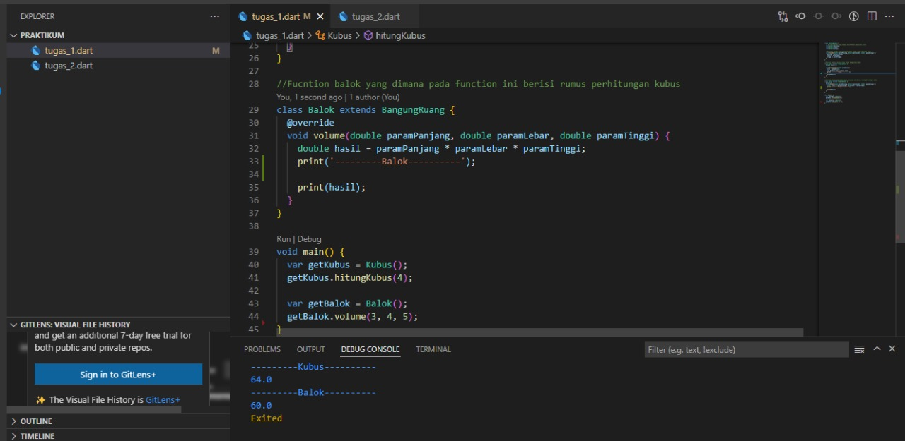
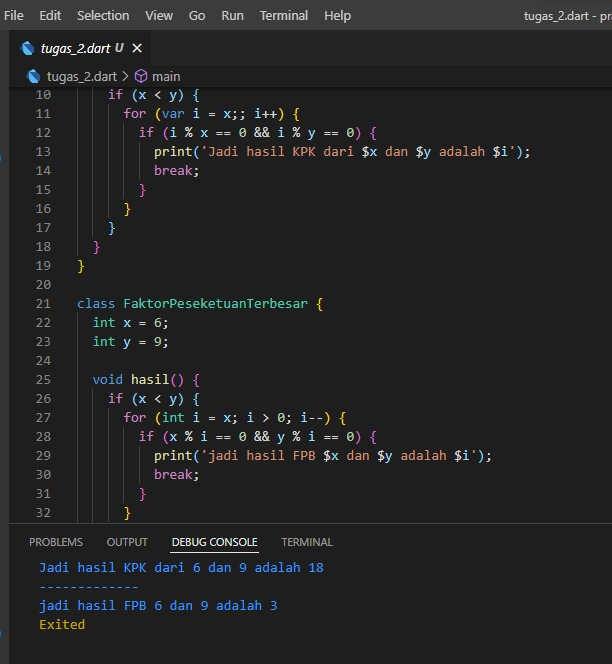

## 10 Dart Object Oriented Programming 2

   OOP (Object Oriented Programming) adalah suatu metode pemrograman yang berorientasi kepada objek. Tujuan dari OOP adalah untuk mempermudah pengembangan dalam program dengan cara mengikuti model yang telah ada dalam dunia nyata. Didalam OOP dapat mennyusun dalam bentuk abstraksi object. Keuntungan OOP adalah mudah mencari error pada program dan mudah digunakan ulang dikarena setiap object memiliki kesamaan ciri2.

   OOP memiliki beberapa kompenen lanjutan antara lain yaitu:

   1. Constructor
      Method yang dijalankan saat pembuatan object yang dapat menerima parameter dan tidak memiliki retrun. Untuk penulisan method Constructor harus sama dengan nama kelas
      
      ```
      class mobil{
          \\property
          \\method

          void mobil(){
              print('ini Constructor');
          }
      }
      ```

   2. Inheritance
      Merupakan pewarisan, jadi class baru memiliki semua yang dimiliki oleh class yang di extends,contoh

      ```
        void main() { 
        
        @override
        var item = segitiga(); 
        item.luas_item(); 
        }  
        
        class Object { 
            
        void luas_item() { 
            print("Menghitung luas segitiga"); 
            } 
        }  

        class Segitiga extends Object {}
      ```

   3. Interface
      yang saya pahami simplenya adalah kontrak yang ada di class, jad apabila class a ingin implement dengan class b maka class a harus mengikuti isi yang ada dikelas b atau bisaa dibilang kontrak.

        ```
        class Menghitung {

            void hasil (){
               
            }
        }

        class Rumus(){

            void hasil(){

            }
        }
       
        ```
    
   4. Abstrack class
      Berupa class astrak yang menunjukan method apa saja yang ada pada suatu class

## Task


### 1. Tugas Pertama
Pada tugas pertama ini membuat spesifikasi class yang sudah disediakan dan dari rangkaian class yang sudah ditentukan melakukan overriding. Dan mengimplementasikan pewarisan.

Berikut kode tugas pertama

[tugas_1](./praktikum/tugas_1.dart)

output:



### 2. Tugas Pertama
Pada tugas kedua ini mengimplementasikan interface dan membuat spesifikasi class yang sudah ditentukan

Berikut kode tugas kedua

[tugas_2](./praktikum/tugas_2.dart)

output:


      
