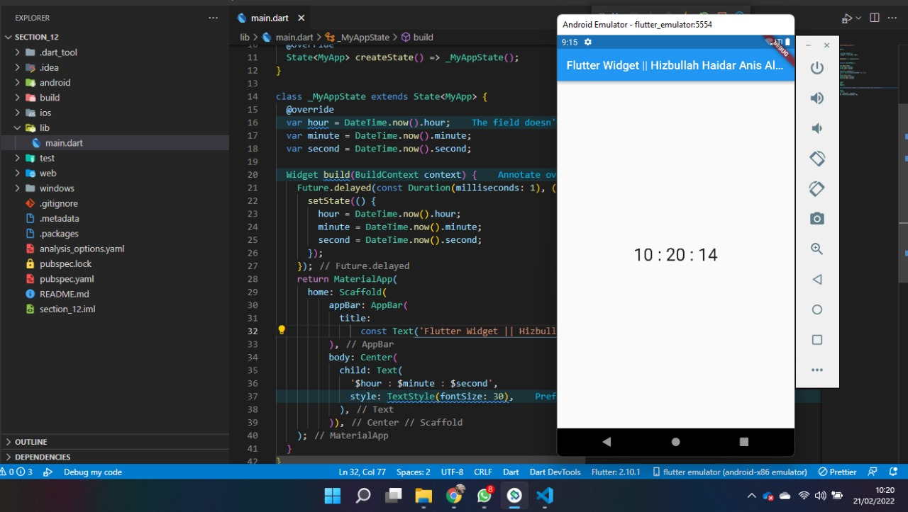
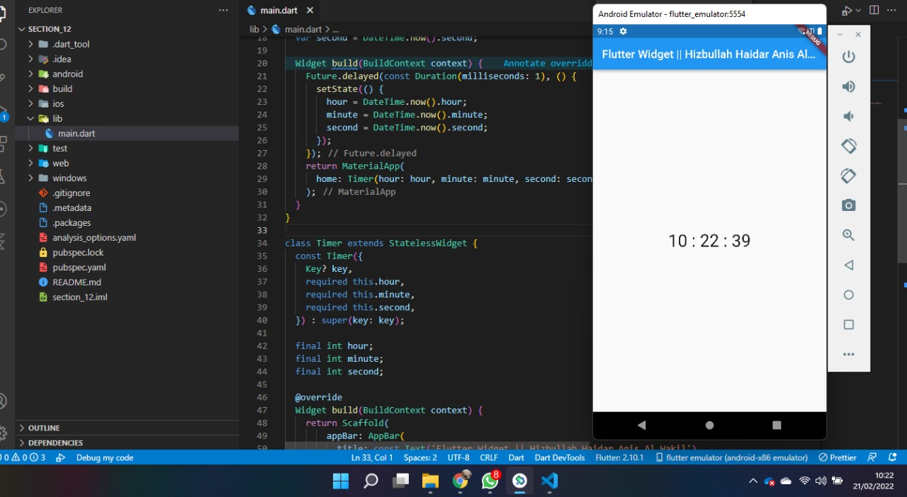

## 12 Introduction Flutter Widget
   
   Flutter adalah framework dari bahasa pemograman dart yang digunakan untuk membangun antarmuka pengguna yang digunakan untuk membuat website,
   aplikasi mobile dan dekstop. Keunggulan flutter antara adalah mudah digunakan, dipelajari dan komunitas yang berkembang. Didalam flutter rerdapat widget, widget itu sendiri adalah sebuah komponen seperti butto, text dan sebagainya. Widget terdiri dua jenis yaitu stateles dan stateful, statles digunakan untuk statis atau dibilang tidak ada perubahan data dan stateful sebaliknya digunakan dinamas yang dimana tampilan widget atau data dapat berubah sewaktu-waktu.
   

   Built in widget:

   1. MaterialApp
      MaterialApp digunakan untuk membangun aplikasi dengan desain material, contoh penulisan

      ```
      retrun MaterialApp(
          home : Text('Hizbullah Haidar Anis Al Wakil'),
      )
      ```

   2. Scaffold
      Digunakan untuk membuat sebuah halaman

      ```
       retrun Scaffold(
          body: Text('Hizbullah Haidar Anis Al Wakil'),
      )
      ```
   3. Appbar
      Membentuk application bar yang terletak pada bagian atas halaman

        ```
        Appbar(
            Title : Text('Akil'),
        );
        ```
   4. Text
      Untuk menampilkan text

        ```
        const Text('akil'),
        ```
  
## Task

### 1. Tugas Pertama
Pada tugas pertama ini membuat widget yang kontenya berbah setiap detik

Berikut kode tugas pertama

[tugas_1](./praktikum/tugas_1/lib/main.dart)

output:



### 2. Tugas Kedua
Pada tugas kedua ini sama dengan tugas pertama akan tetapi filenya dipisahkan atau extract widget

Berikut kode tugas kedua

[tugas_2](./praktikum/tugas_2/lib/main.dart)

output:



