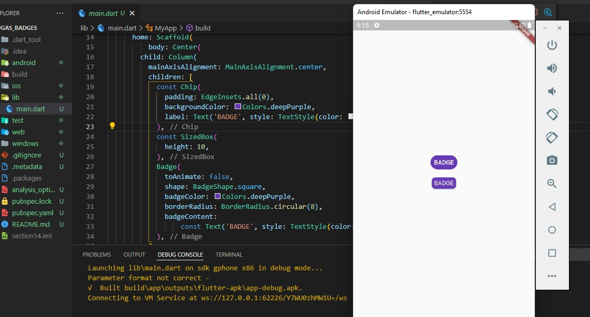
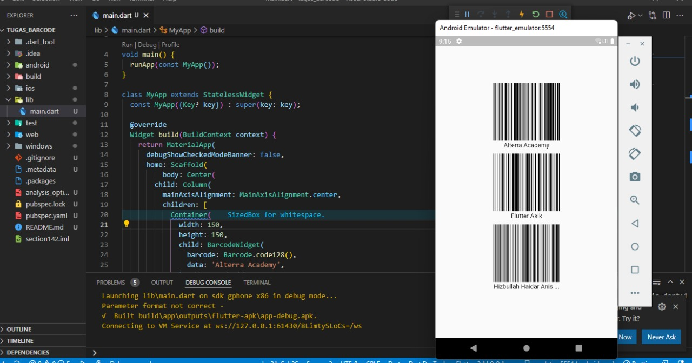

## 13 Flutter Command Line Interface (CLI) and Flutter package management

Dalam materi ini, mempelajari:
1. Flutter Cli
2. Importan CLI Commands
3. packages Management

### Flutter Cli
Flutter Cli merupakan singkatan dari Command Line Interface  yang digunakan untuk berinteraksi dengan Flutter SDK dan Perintah ini dijalankan melalui terminal

### Importan CLI Commands
Perintah-perintah yang ada di flutter cli antara lain yaitu:
* Flutter Doctor, merupakan perintah untuk menampilkan informasi software yang dibutuhkan oleh flutter
* Flutter Create, merupakan perintah untuk membuat folder atau project flutter
* Flutter Run, merupakan perintah untuk menjalankan project
* Flutter Emulator, perintah untuk menampilkan daftar emulator yang ada diterminal
* Flutter Channel, perintah untuk menampilkan daftar flutter channel
* Flutter Pub, pada flutter pub ada dua syntax yang bisa digunakan yaitu flutter pub add untuk menambahkan packages dan flutter get 
  untuk mendownload semua packages
* Flutter Build perintah untuk memproduksi sebuah file aplikasi.
* Flutter Clean, perintah untuk memperkecil ukuran project 

### packages Management
Flutter mendukung sharing packages yyang dibuat oleh developer lain, cara menambahkan packages tersebut sebagai berikut:
* Kunjungi website https://pub.dev/ dan cari packages yang diinginkan
* Setelah mendapatkan packages yang diinginkan klik packages tersebut, dan langsung bisa klik install melalui command line atau 
  menambahkan dependencies. Setelah install atau menambahkan dependencies paka jalankan perintah flutter pub get pada command line

## Task

### 1. Tugas pertama
Pada tugas pertama ini menggunakan package https://pub.dev/packages/badges dan membuat tampilan yang sudah ada.

Berikut kode tugas pertama.

[main.dart](./praktikum/tugas_badges/lib/main.dart)

output badges:

### 2. Tugas kedua 
Pada tugas kedua ini menggunakan package https://pub.dev/packages/barcode_widget dan membuat tampilan barcode yang berisi Alterra Academy, flutter asik dan nama panjang.

Berikut kode main.dart.

[main.dart](./praktikum//tugas_barcode/lib/main.dart)

output:

