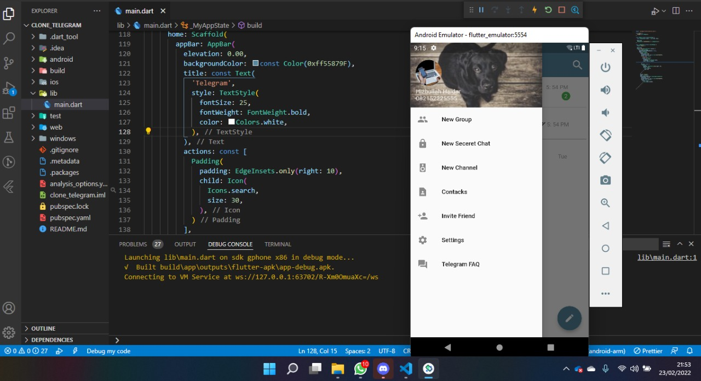
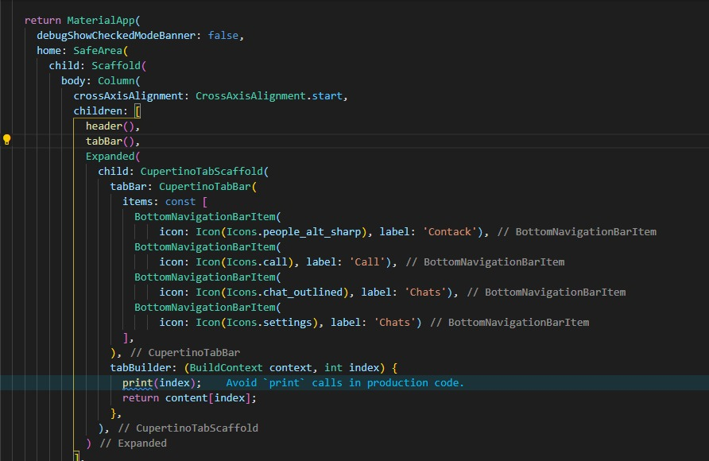

## 13 Platform Widget

Dalam materi ini, mempelajari:
1. MaterialApp
2. Cupertino

### MaterialApp
MaterialApp merupakan widget dasar yang mengemas dalam aplikas sistem android, untuk menggunakan widget ini maka harus  import ```package:flutter/material.dart';```. MaterialApp terdapat scafold yang berfungsi untuk membangun sebuah halaman yang dimana stuktur scafold terdiri dari appBar bagian menu atas halaman, drawer menu bagian samping halaman, body bagian utama halaman, bottomNavigationBar bagian bawah halaman.  

### Cupertino
Cupertino merupakan widget dasar yang mengemas dalam aplikas sistem iphone,  untuk menggunakan widget ini maka harus  import ```package:flutter/cupertino.dart';```. Sama seperti MaterialApp, Cupertino memiliki seperti scafold yang bernama CupertinoApp.


## Task

### 1. Clone Telegram
Pada tugas pertama ini membuat atau clone tampilan aplikasi telegram menggunakan flutter material.

Berikut kode clone telegram.

[main.dart](./praktikum/clone_telegram/lib/main.dart)

output home:


output drawer:



### 2. Clone Wa
Tugas selanjutnya adalah clone WA yang dimana tampilanya menggunakan flutter Cupertino

Berikut kode main.dart.

[main.dart](./praktikum/cupertino/lib/main.dart

berikut code image yang menggunakan Cupertino search textfield


Dan berikut code image yang menggunakan Cupertino TabBar




output:


