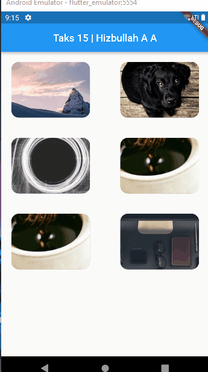

## 15 Assets

Dalam materi ini, mempelajari:
1. Assets
2. Image
3. Font

### Assets
Assets merupakan file yang di bundled dan di deployed bersamaan dengan aplikasi dan tipe-tipe assets seperti static data, icons, images dan font file yang berformat tff. Untuk menentukan assets, flutter menggunakan pubspec.yaml yang terletak pada root project untuk mengidentifikasi assets yang dibutuhkan aplikasi

### Image
Di flutter mendukung format gambar seperti JPEG, WebP, GIF, Animated Web/Gif, PNG, BMP, dan WBMP. Untuk menggunakan image pada flutter maka menggunakan widget image yang membutuhkan properti image dengan nilai class AssetImage atau Image.asset dan Imgae.network. Untuk menggunakan asstes image maka membuat folder assets dan tambah lokasi assets pada pubspec.yaml

### Font
Penggunaan font pada flutter bisa menggunakan costum font atau dari package. Untuk menggunakan costum font maka buat folder font dan download font yang diinginkan pada google font setelah itu file tff pindahkan kefolder font dan tambah lokasi font pada pubspec.yaml

## Task

### Tugas pertama dan kedua
Pada tugas pertama minimum membuat 3 gambar dari internet menggunakan grid view dan pada tugas keduanya apabila gambar ditekan maka akan terbuka halaman baru yang menampilkan gambar yang ditekan dan gambar memenuhi gambar

Pada tugas ini saya menggabungkan 2 tugas tersebut kedalam 1 file project yang dimana menurut saya tugas pertama dan kedua itu saling berhubungan.

[main.dart](./praktikum/tugas_one/lib/main.dart)

output badges:

