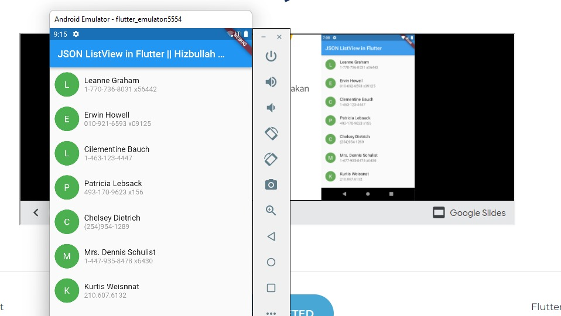
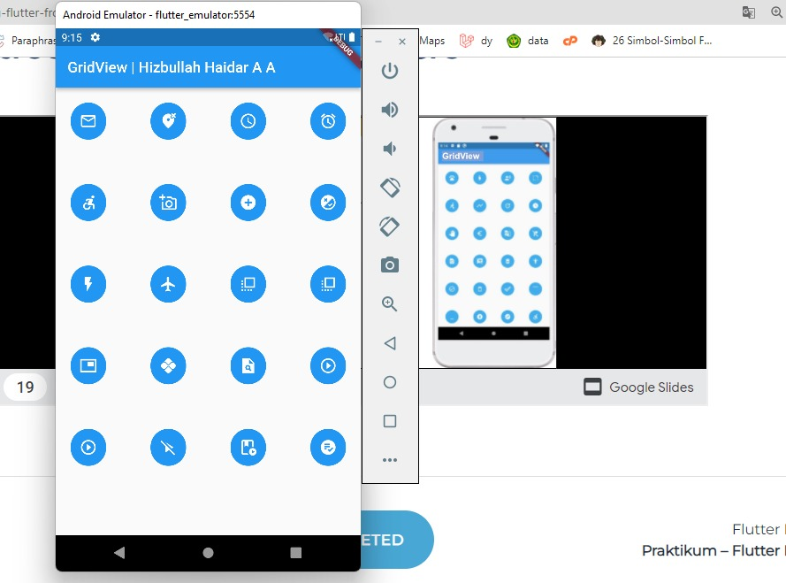

## 15 Flutter Layout

Dalam materi ini, mempelajari:
1. Single Child Layout
2. Multi Child Layout

### Single Child Layout
Single Child Layout digunakan untuk widget yang  bisa menampung 1 buah child

### Multi Child Layout
Sedangkan Multi Child Layout dunakan untuk banyak widget atau bisa dibilang array widget dengan property children. adapun widget ini terdiri dari Row, Column, Listview, GridView dan stack
* Row
Row digunakan untuk meletakkan Widget secara Horizontal, pada row terdarpat crossaxisalignment  dan MainAxisAlignment. crossaxisalignment widget row memiliki makna vertikal  dan mainAxisAlignment widget row memiliki makna horizontal
* Column
Verti digunakan untuk meletakkan Widget secara vertikal. Sedangkan untuk crossaxisalignment dan MainAxisAlignment pada column sebaliknya pada row.
* ListView
Lisview merupakan mengatur widget dalam bentuk list yang dimana biasanya widget ini digunakan apabila widget body overflow 
*Gridview
Widget ini memungkinkan  untuk membuat daftar dengan satu atau lebih pohon widget  di setiap baris, jumlah widget yang ditampilkan dapat disesuaikan sesuai  kebutuhan.
*Stack
Stack digunakan untuk menampilkan beberapa lapis widget.

## Task

### 1. Tugas pertama
Pada tugas pertama ini diperintahkan untuk mengimplementasikan lisview dan mengikuti desain yang sudah ditentukan

Berikut kode tugas pertama.

[main.dart](./praktikum//ListView/lib/main.dart)

output badges:

### 2. Tugas kedua 
Pada tugas kedua ini diperintahkan untuk mengimplementasikan GridView dan mengikuti dedain yang sudah ditentukan

Berikut kode main.dart.

[main.dart](./praktikum/GridView/lib/main.dart)

output:

