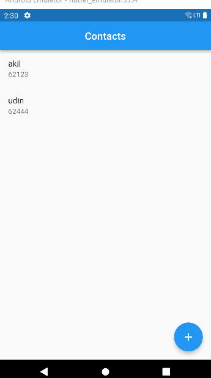

## 16 Form Input Button

Dalam materi ini, mempelajari:
1. Form
2. Input
3. Button

### Form
Form merupakan sebuah objek kontrol untuk menerima data dari pengguna, yang dimana isian data dapat lebih dari satu

### Input
Input widget terdiri dari Textfield untuk menerima isian data dari pengguna, Radio untuk memberi opsi pada pengguna, Checkbox sama seperti radio untuk memberi opsi pada pengguna tapi berbentuk pilihan centang, dan dropdown button untuk memberi opsi dengan bentuk drop down.

   

### Button
Button bersifat seperti tombol yang dapat melakukan saat di tekan, Button terdiri dari EleatedButton (jika ditekan, akan menjalankan onProssed),IconButton (menampilkan icon dan akan menjalankan onProsses),  

## Task

### Tugas pertama dan kedua
Tugas pertama membaut halaman contack yang dimana menampilkan data nama dan nomor telpon. Dan untuk tugas kedua pada halaman contack ada tombol mengarahkan ke halaman baru yang diberi nama Create New Contack yang menampikan seuab form dan button

[main.dart](./praktikum/form/lib/main.dart)

output badges:

