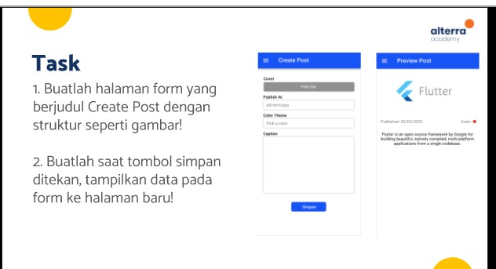
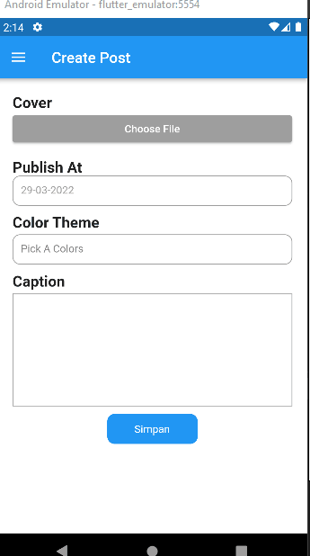

## 16 Form Input Button

Dalam materi ini, mempelajari:
1. Date Picker
2. Color Picker
3. File Picker

### Form
 Date Picker digunakan untuk memilih tanggal dan cara penggunaanya dapat dilihat dibawah ini :
 ```
final selectDate = await showDatePicker(
                      context: context,
                      initialDate: DateTime.now(),
                      firstDate: DateTime(2000),
                      lastDate: DateTime(DateTime.now() + 3),
                    );
                    
 ```

### Color Picker
Color Picker digunakan untuk memilih dambar dan cara penggunaanya dimulai dengan menginstal package flutter_colorpicker 1.0.3. Selanjutnya dapat dilihat dibawah ini :
``` 
 BlockPicker(
                      pickerColor: Color(0xff808080),
                      onColorChanged: (color) {
                        inistate color
                      }

```

   

### File Picker
File picker berfungsi untuk mendapatkan penyimpanan yang ada di hp, untuk menggunakan ini install package file_picker 4.5.1. Selanjutnya bisa diliat di documentasi package tersebut


## Task

### Tugas pertama dan kedua




[main.dart](./praktikum/section17/lib/main.dart)

output badges:




