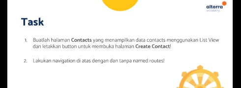
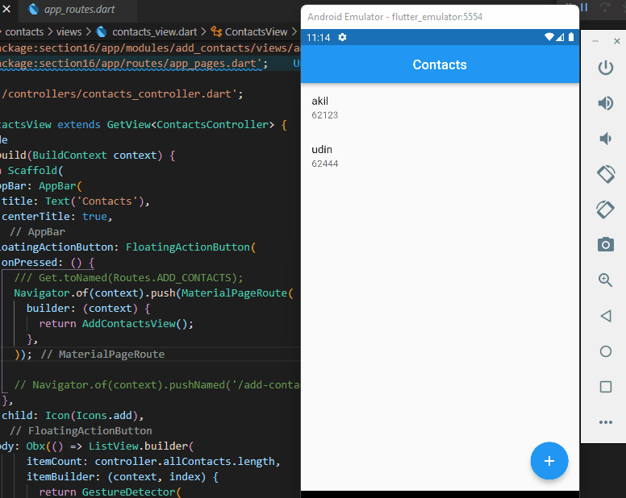

## 16 Form Input Button

Dalam materi ini, mempelajari:
1. Apa itu navigation
2. Navigation dasar
3. Navigation dengan named route

### Apa itu navigation
 Navigation digunakan untuk berpindah dari halaman satu ke halaman lain
 
###  Navigation dasar
Navigation terdiri dari push dan pop. Dan untuk cara penggunaanya dapat dilihat dibawah ini :

```
  // Untuk navigation push
  Navigator.of(context).push(MaterialPageRoute(
              builder: (context) {
                return AddContactsView();
              },
            ));

  // untuk navigation pop
   Navigator.pop(context);

```

###  Navigation dengan named route
Setiap halaman memiliki alamat yang disebut route. Penggunaanya dapat dilihat dibawah ini :

```
Navigator.of(context).pushNamed('/add-contacts');

```


## Task

### Tugas pertama dan kedua




[main.dart](./praktikum/section19/lib/main.dart)

output badges:




