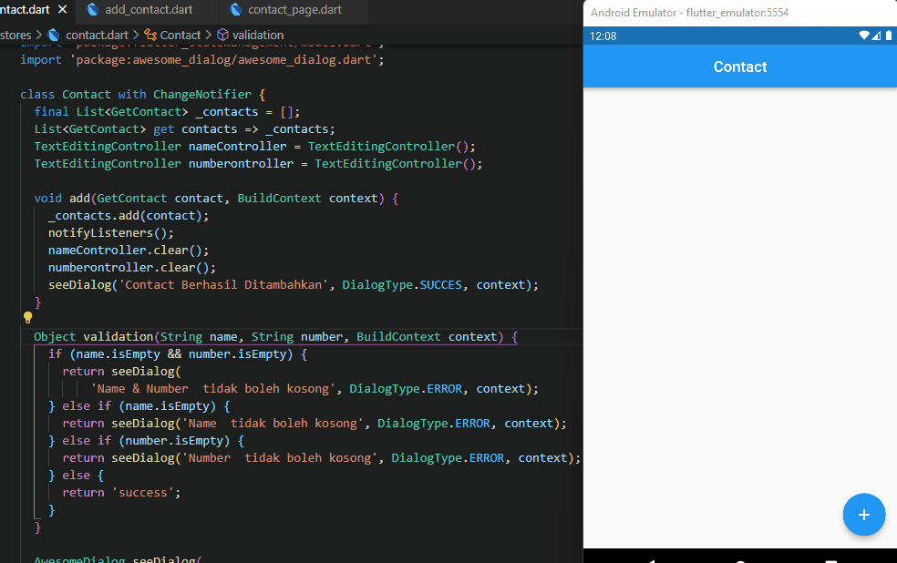

## 16 Form Input Button

Dalam materi ini, mempelajari:
1. Pengertian State 
2. Global State
3. Cara install Provider

### Pengertian State 
 State merupakan data yang dapat dibaca saat pembukaan widget yang dapat berubah saat widget sedang aktif yang hanya dimiliki oleh StatefullWidget
 
###  Global State
Global state merupakan state biasa yang dapat digunakan pada seluruh widget

###  Cara install Provider
Pertama install provider dengan flutter pub add provider pada terminal atau bisa menambahkan dependencies provider: ^6.0.2.

## Task

### Tugas pertama dan kedua

[main.dart](./praktikum/flutter_statemanagement_provider/lib/main.dart)

output badges:

