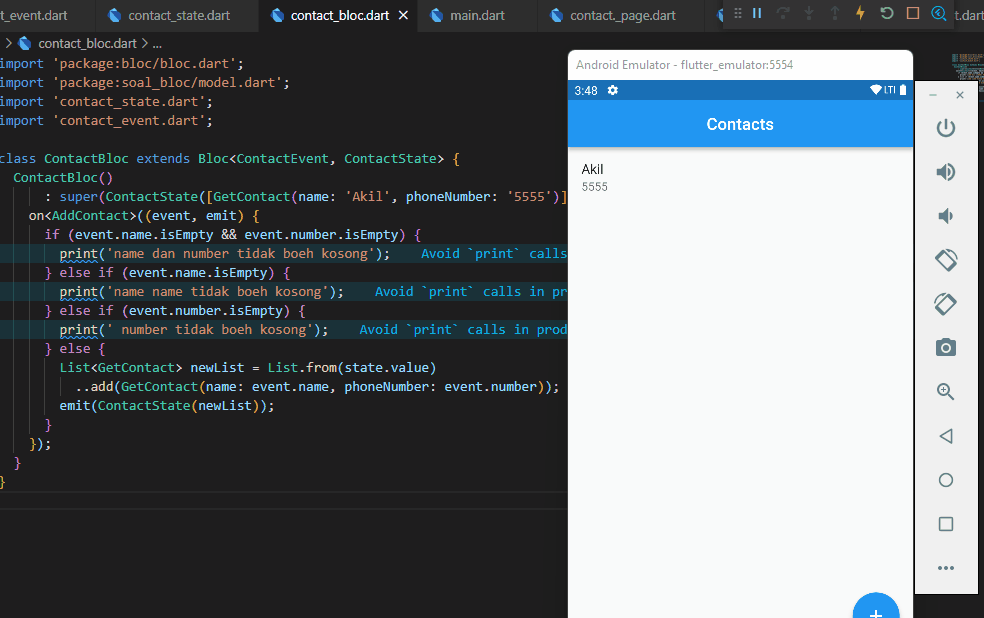

## 16 Form Input Button

Dalam materi ini, mempelajari:
1. Pengertian Bloc
2. kenapa bloc?
3. cara kerja bloc

### Pengertian Bloc 
 Bloc merupakan businees logic component yang memisahkan antara busnise logic dengan ui
 
### Kenapa bloc?
Karena simple, powerful dan testable 

###  Cara kerja bloc
Menerima event sebagai input yang dianalisa dan dikelola oleh bloc.

## Task

### Tugas pertama dan kedua

[main.dart](./praktikum/statemanagement_bloc/lib/main.dart)

output badges:

