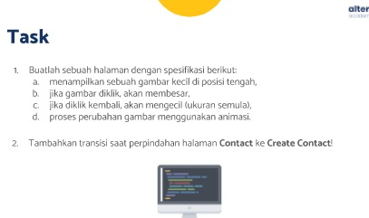
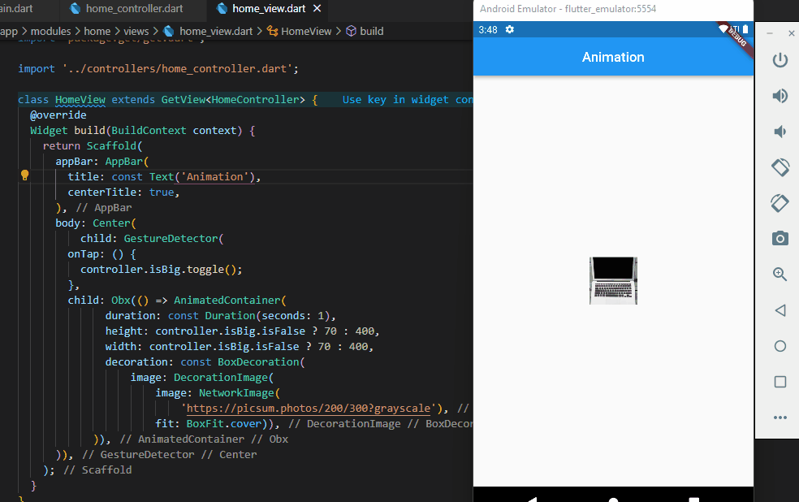
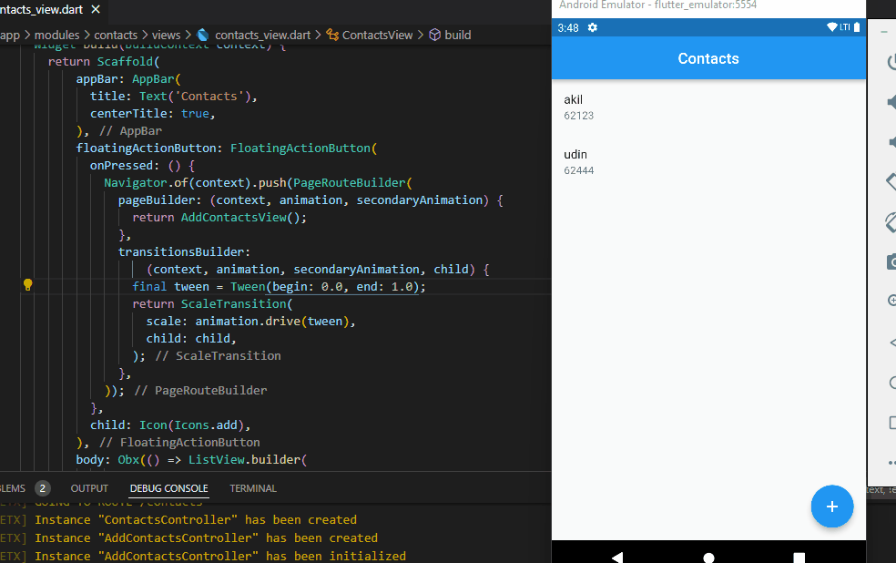

## 23 Fluuter Animation

Dalam materi ini, mempelajari:
1. Animation
2. Transition
3. Transition Umum

### Animation  
 Animation membuat aplikasi terlihat hidup yang dimana widget dapat bergerak yang bisa menambah daya tarik
 
###  Transition
Transition merupakan animasi yang terjadi saat perpindahaan halaman yang dilakukan pada bagian Navigator.push()

###  Transition umum
Transition umum yang digunakan adalah FadeTransition dan ScaleTransition, 

## Task

### Tugas pertama dan kedua

[main.dart](./praktikum/soal1/lib/main.dart)

output soal 1 badges:

[main.dart](./praktikum/soal2/lib/main.dart)

output soal 2 badges:

