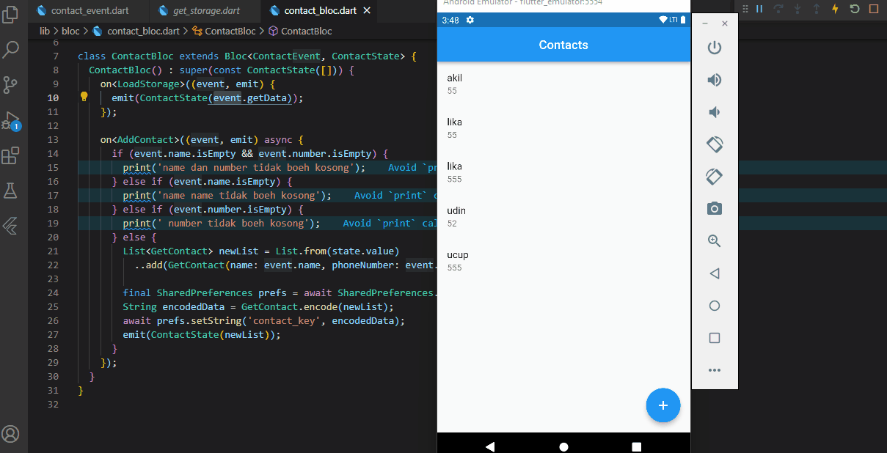

## 22 Fluuter Animation

Dalam materi ini, mempelajari:
1. Penyimpanan lokal
2. Shared preferences
3. Lokal database (SQlite)
 

### Penyimpanan lokal 
 Penyimpanan lokal maksudnya adalah data-data yang ada diaplikasi disimapan dilokal, jadi tidak masuk ke database melalui api dll.
 
###  Shared preferences
Shared preferences digunakan untuk menyimpan data sederhana dengan penyimanan dengan format key-value yang menyimpan data seperti text, bool dan angka

###  Lokal database (SQlite)
Lokal database (SQlite) digunakan untuk meyimpan dan meminta data dalam jumlah besar pada local device yang bersifat private. Package ini mendukung CRUD(Create, Read, Update dan Dete)

## Task

### Tugas pertama dan kedua

[main.dart](./praktikum/statemanagement_provider/lib/main.dart)

output soal 1 badges:

[main.dart](./praktikum/statemanagement_bloc/lib/main.dart)

output soal 2 badges:

