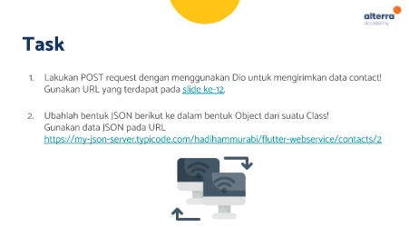
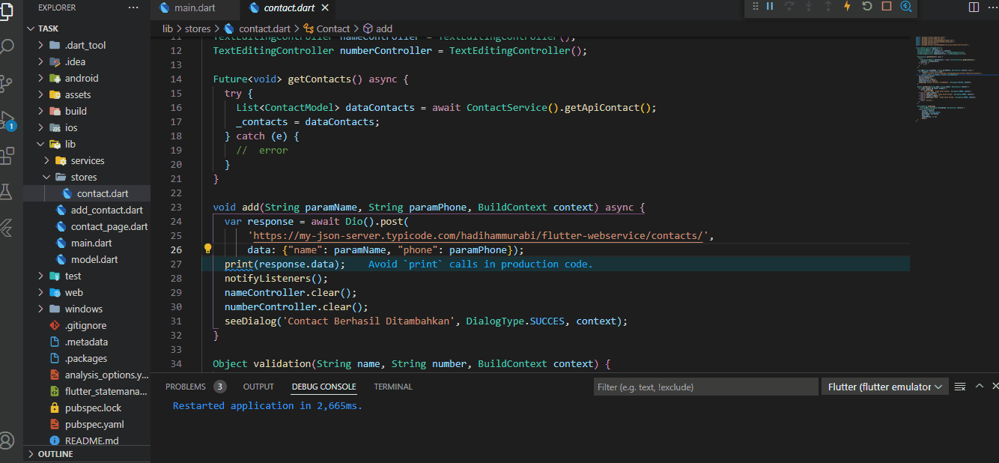
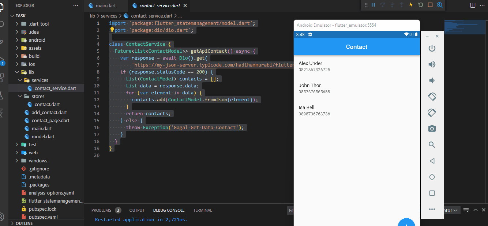

## 24 Introduction REST API – JSON serializationdeserialization

Dalam materi ini, mempelajari:
1. Rest API
2. HTTP
3. Dio
4. Serialization/deserialization

### Rest API
 Rest API merupakan arsitektural yang memisahkan tampilan dengan proses bisnis
 
### HTTP
HTTP merupakan protokol yang digunakan untuk berikirim data pada internet yang biasanya data tersebut berbentuk media web.

###  Dio
DIO merupakan package flutetr yang berfungsi untuk melakukan rest api

###  Serialization/deserialization
Untuk mengubah data json ke list atau map maka menggunakan deserialization decode dan sebaliknya mengubah data list/map ke json encode.

## Task

### Tugas pertama dan kedua

[main.dart](./praktikum/task/lib/main.dart)

output task 1:

output task 2:

