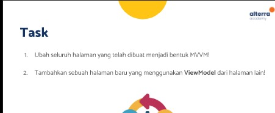
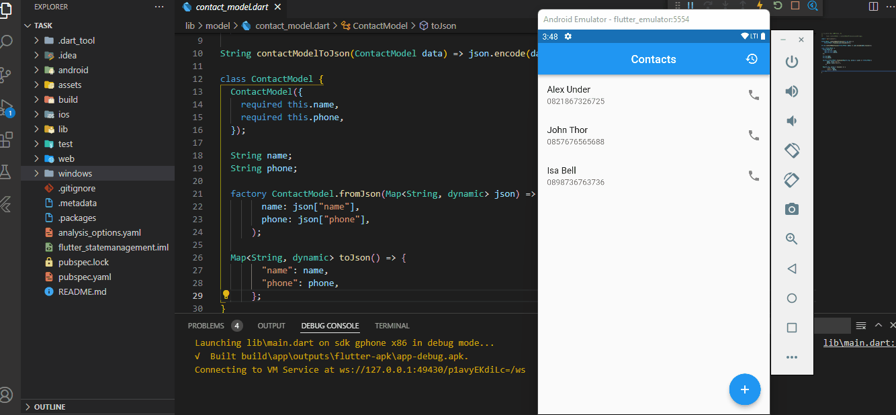

## 25 MVVM Architecture

Dalam materi ini, mempelajari:
1. Apa itu MVVM Architecture?
2. Keuntungan yang didapatkan
3. Aturan pada MVVM

### Apa itu MVVM Architecture?
 MVVM atau model-view view model digunakan untuk memisahkan logic dengan tampilan (view) kedalam view model
 
###  Keuntungan yang didapatkan
 Keuntungan yang didapatkan ialah :
 1. Reusability
    Jika ada beberapa tampilan memerlukan logic yang sama, bisa menggunakan view model yang sama
 2. Maintainbility
    Mudah dirawat dikarenkan pekerjaan terkait tampilan tidak menumpuk dengan logic
 3. Testability
    Pengujian menjadi terpisah antara pengujian tampilan dengan pengujian logic sehingga dapat meningkatkan productivitas pada pengujian

###  Aturan pada MVVM
Terdapat 2 folder yang dibikin pada folder lib, yaitu folder model dan model screen. folder model berisi file model dan folder api yang didalamnya logic get api dan pada folder screen terdapat file screen dan file screen view model.

## Task

### Tugas pertama dan kedua

[main.dart](./praktikum/task/lib/main.dart)

output :

