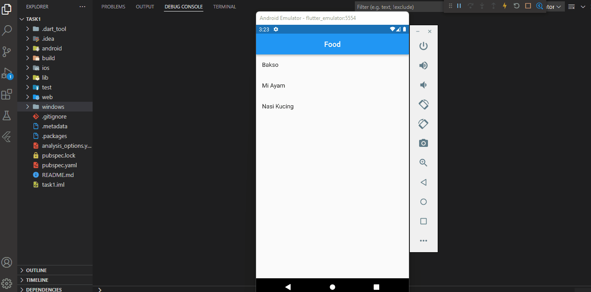

## 26 Finite State Machine & Unit Testing

Dalam materi ini, mempelajari:
1. Finite State Machine
2. Unit Testing
3. Mocking

### Finite State Machine
 Finite State Machine adalah mesin yang memiliki sejumlah state dan tiap state menunjukan apa terjadi sebelumnya
 
###  Unit Testing
 Unit Testing adalah salah satu jenis pengujian pada perangkat lunak yang pengujian dilakukan pada unit dalam perangkat lunak. Unit test yang dimaksud umumnya adalah fungsi atau method

###  Mocking
 Mocking adalah proses terikat dengan sistem eksternal dapat mempengaruhi berjalannya pengujian. Pengaruh tersebut dapat menggangu proses pengujian. Mocking untuk menghindari masalah-masalah tersebut.

## Task

### Tugas pertama dan kedua

[main.dart](./praktikum/task/lib/main.dart)

output :

