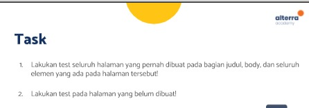
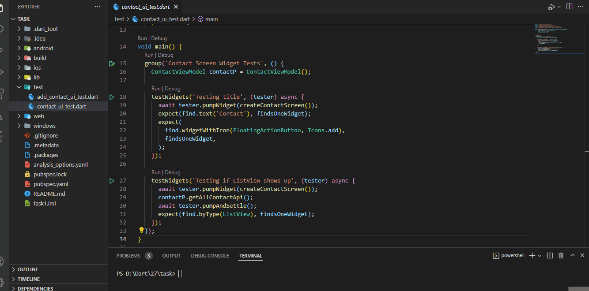

## 27 UI Testing

### Penegertina UI Testing
 UI testing merupakan pengujian yang dilakukan pada tampilan suatu aplikasi untuk memastikan aplikasi aplikasi dapat menerima interaksi dan memberi respon pengguna

## Task

### Tugas pertama dan kedua

[main.dart](./praktikum/task/lib/main.dart)

output :

