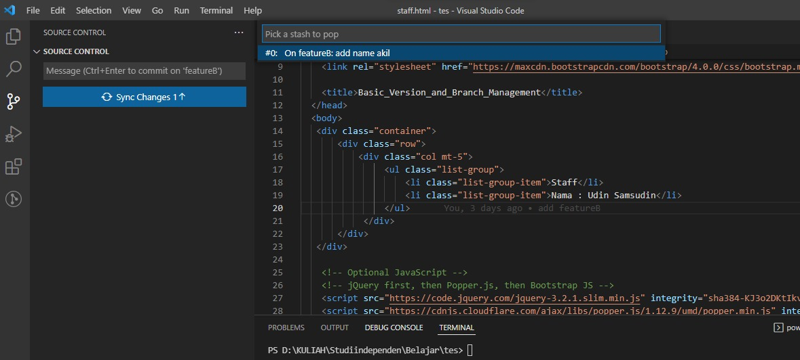

## 2 Basic Version and Branch Management (Git)

   GitHub adalah  aplikasi berbasis web dengan sistem kontrol yang menyediakan layanan penyimpanan repository gratis dan git merupakan version control yang dapat berkolaborasi dengan berbagai developer dan  bertugas untuk mencatat perubahan seluruh file atau repository suatu project adapun Version control system (VCS) merupakan sebuah deretan software yg telah terintegrasi & dipakai buat membantu perangkat lunak engineer mengelola perubahan pada source code berdasarkan waktu ke waktu.

### Macam - macam git

   1. Git init berfungsi untuk membuat repository pada file lokal, untuk cara penulisannya ``` git init ```
   2. git add  berfungsi untuk menambahkan file baru pada repository ``` git add . ```
   3. git status berfungsi untuk mengetahui status repo local, untuk cara penulisannya ```git status```
   5. git commit untuk menyimpan perubahan yang dilakukan oleh developer dan team, untuk cara penulisannya 
      ```git commit -m "disini isi" pesan"```
   4. git push berfungsi untuk mengirim perubahan file yang sudah commit oleh developer atau team, untuk cara penulisannya
       ```git push"```
   5. git branch untuk melihat seluruh branch direpo, untuk cara penulisannya ```git branch```
   6. git checkout berfungsi untuk merubah branch yang aktif ke branch yang dipilih, untuk penulisanya ```git checkout NamaBranch```
   7. git merge untuk menggabungkan branch, untuk penulisannya ```git merge NamaBranch```
   8. git clone berfungsi untuk membuat salinan repo lokal, untuk penulisannya ```git clone urlRepo```

## Task

### 1. Membuat repo digithub dan implementasikan penggunaan branching 
pada soal pertama dan kedua membuat repo dan  implementasikan penggunaan branching yang terdiri dari master, development, featureA dan featureB. Untuk penggunaan git dapat dilihat dibawah ini:


### 2. Implementasikan git push, pull, stash dan merge
implementasi git push, pull, stash dan merge dapat dilihat dibawah ini

git push


git pull


git stash


git merge


### 3. Implementasikan conflic
Untuk mengemplementasikan conflic maka harus melakukan perubahan yang berbeda pada branch featureA dan develepoment, dapat dilihat conflic dibawah ini:


### 4. Network atau hasil


