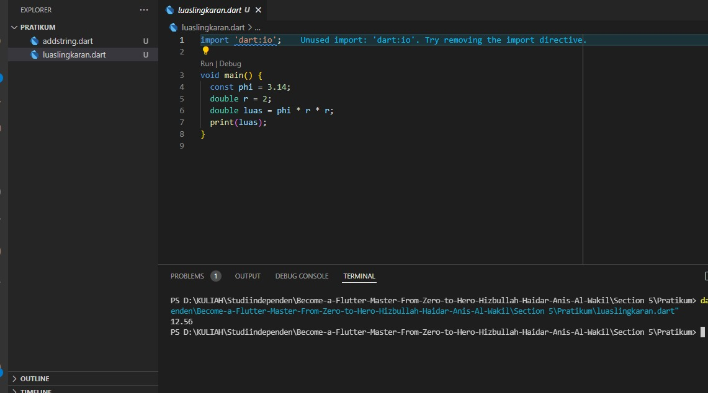
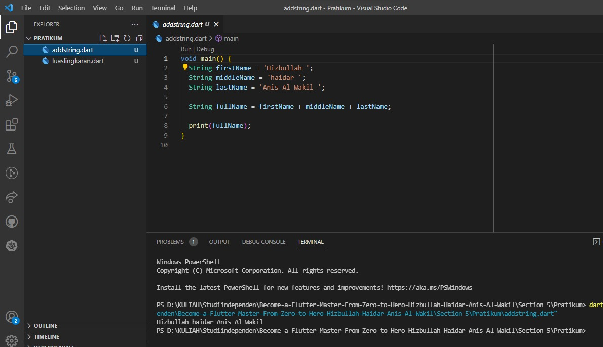

## 5 Introduction to Algorithm and Dart Programming
Dalam materi ini, mempelajari:
1. Apa dan mengapa menggunakan dart
2. Fungsi main
3. komentar
4. variable
5. Tipe Data
6. Operator

### Apa dan mengapa menggunakan dart
Bahasa pemograman dart digunakan untuk membuat aplikasi yang berjalan disisi client(frontend), seperti aplikasi mobile, website dan desktop.

### Fungsi main
Pertama kali untuk menjalankan pemograman dart adalah menuliskan fungsi main. contoh:

```
    void main(){

    }
```
### Komentar 
Komentar merupakan baris code yang tidak dijalankan dengan tujuan membari catatan dan mencegah perintah yang dijalankan. Ada dua cara untuk menuliskan komentar yaitu

1. Diawali dengan tanda garis miring 2 kali, contoh

``` 
    void main(){
        // print nama akil
        print('akil);
    }

```

2. Diawali dengan tanda garis miring dan bintang dan diakhiri dengan tanda bintang dan garis miring, contoh

```
    void main(){
        /* 
        disini dituliskan
        nama akil
        */
        print('akil');
    }

```
### Variable
Variable untuk menyimpan data, memiliki nama dan memiliki tipe data, contoh

```
    void main(){
        String name = 'akil';
        print(name);
    }
```
### Tipe data
Tipe data merupakan jenis data yang dapat dikelola, misalnya apabilsa jenis datanya berupa kata maka menggunakan tipe data String atau yang lainya. Ada beberapa jenis tipe data yang sering digunakan. Yaitu int untuk bilangan bulat, double untuk bilangan pecahan, bool untuk benar atau salah dan string untuk data text

### Operator
Operator digunakan untuk operasi pengolahan data dan data yang dikelola disebut operand. Dari penggunaan operator ini simbol yang digunakan sama saja pada operator pada umumnya seperti perkalian menggunakan tanda *, dari tambah menggunakan tanda +. Yang membedakan mungkin dari tanda bagi menggunakan tanda / dan hasil bagi menggunakan tanda %.

## Task

### 1. Impementasi rumus luas lingkaran pada program dart
Pada task ini, Implementasi rumus luas lingkaran hasil dari pembelajaran Introduction to Algorithm and Dart Programming.

Berikut kode rumus luas lingkaran.

[luaslingkaran.dart](./praktikum/luaslingkaran.dart)

output:



### 2. Membuat 3 buah variable yang berisi string dan digabungkan

Berikut kode membuat 3 variable dan digabungkan.

[addstring.dart](./praktikum/addstring.dart)

output:




