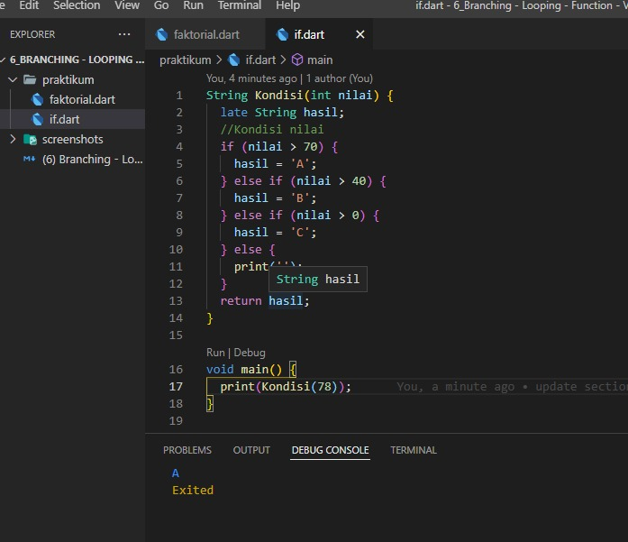

## 6 Branching - Looping - Function


If adalah syarat dipakai saat akan menciptakan program yg didalamnya masih ada pemilihan/pengkondisian/penyeleksian buat satu butir kondis dan if else  digunakan ketika  membuat program yang didalamnya terdapat lebih dari satu kondisi, contoh

```
    void main(){

        int a = 10;
        int b = 20;

        if(a > b){
            print('$a lebih dari $b');
        }else if(a == b){
            print ('$a sama dengan $b');
        }else{
            print ('$a kurang dari $b');
        }
    }
    
```


Looping merupakan instruksi khusus dalam bahasa pemrograman dan algoritma yang digunakan untuk mengulang beberapa perintah sesuai dengan jumlah yang telah ditentukan. Ada for loop, for in loop, fo each loop, while loop, and do while loop 

1.	For loop merupakan digunakan untuk mengulang suatu proses yang telah diketahui jumlah perulangannya.
2.	While digunakan bila jumlah perulangannya belum diketahui.
3.	Do while digunakan bila jumlah perulangan do - while sama saja dengan struktur while, hanya saja pasa proses seleksi kondisi 
    letaknya berada di bawah batas perulangan


## Task

### 1. Perkondisian
Terdapat sebuah nilai jika nilai lebih dari 70 maka mengembalikan nilai A, jika nilai lebih dari 40 maka mengembalikan B, jikan nilai > 0 maka mengembalikan teks kosong.

Berikut kode perkondisian nilai.

[if.dart](./praktikum/if.dart)

outpus:

