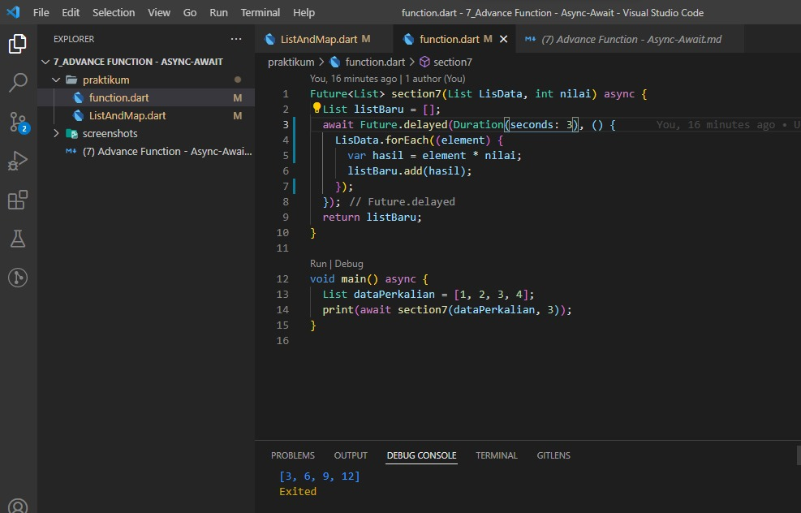

## 7 Advance Function - Async-Await

Dalam materi ini, mempelajari:
1. Function
2. List
3. Map List
4. Async-Await

### Function
Fungsi atau function merupakan blok program yang dirancang untuk melaksanakan tugas tertentu atau struktur pengelompokan yang mengandung sekelompok pernyataan yang akan dilaksanakan oleh CPU jika nama function tersebut dipanggil untuk dieksekusi, kecuali untuk function utama yaitu void main() yang akan dieksekusi secara otomatis. Untuk menuliskan function dapat dengan cara anonymous function (tidak ada nama function) dan arrow function. Dapat dilihat contoh penulisan function dibawah ini:

   ###### a. Anonymous function
            ``` 
             var hellow = (){
                 print('hellow);
             }
            ```                
   ###### b. Arrow function
            ``` 
             var hellow () => print('hellow'); 
            ``` 
### List
List merupakan berisi kumpulan data yang mampu menyimpan beberapa nilai dalam satu variabel. Untuk penulisan list salah satunya sebagai  berikut :

   ###### Penulisan list
            ``` 
             var nameList = [data1, data2, data3,];
            ```                
   Untuk menampilkan list dapat langsung menggunakan print atau looping, dapat dilihat pada contoh dibawah ini 

   ###### a. Menampilkan list dengan menggunakan print
            ``` 
            print(nameList);
            ```
   ###### b. Menampilkan list dengan looping
            ``` 
             for(var list in nameList) {
                print(list);
             }
            ```

### Map List
Map List hampir sama dengan list biasanya, akan tetapi map list mempunyai tipe data key dan value mirip seperti index. apabila list index dibikin secara otomatis dan nilainya secara auto increment. sedangkan map key bisa ditentukan dengan tipe data apapun. Untuk penulisan list dapat dilihat dibawah ini:

    ###### a. Menampilkan Map list dengan menggunakan print
            ``` 
            var name = {
                'first' : 'akil',
                'last'  :  yahuy',
            };

            //untuk menampilkan map list
            print(name['first']);
            ```

### Async-Await
Berfungsi untuk menjalankan beberapa proses tanpa perlu menunggu.

## Task

### 1. Tugas Pertama
Pada tugas pertama ini membuat function dengan menerima 2 parameter yaitu list dan pengali, melakukan perulangan pada list data secara Async, setiap perulangan, mengalikan antara elemnt list data dengan pengali

Berikut kode tugas 1.

[function.dart](./praktikum/function.dart)

output:



### 2. Tugas Kedua
Tugas selanjutnya adalah membuat list dengan spesifikasi setiap element berupa list, setiap element wajib terdiri dari 2 data sub dan membuat sebuah MAP dengan menggunakan list tersebut

Berikut kode tugas 2.

[ListAndMap.dart](./praktikum/ListAndMap.dart)

output:


