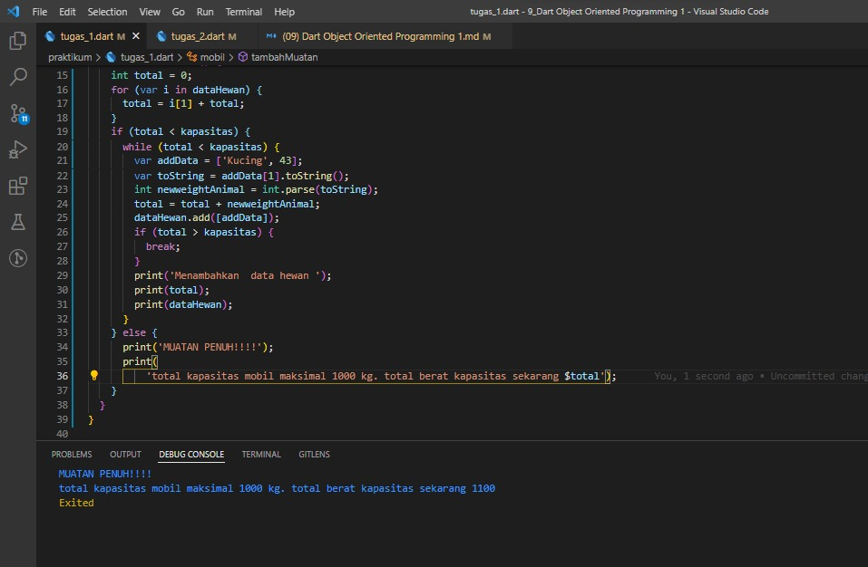
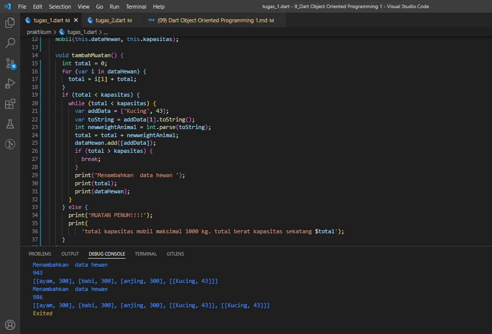
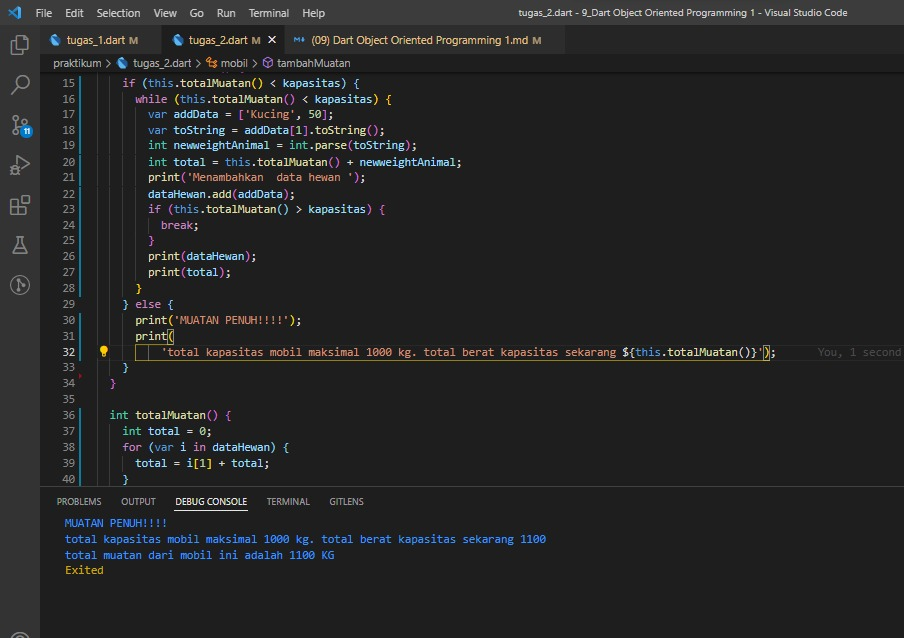

## 9 Dart Object Oriented Programming 1

   OOP (Object Oriented Programming) adalah suatu metode pemrograman yang berorientasi kepada objek. Tujuan dari OOP adalah untuk mempermudah pengembangan dalam program dengan cara mengikuti model yang telah ada dalam dunia nyata. Didalam OOP dapat mennyusun dalam bentuk abstraksi object. Keuntungan OOP adalah mudah mencari error pada program dan mudah digunakan ulang dikarena setiap object memiliki kesamaan ciri2.

   OOP memiliki beberapa kompenen antara lain yaitu:

   1. Class
      Class merupakan cetakan atau blueprint dari sebuah object yang memiliki ciri-ciri yang disebut property dan memiliki method atau function. Untuk menuliskan class dapat dibawah ini:

      ```
      class mobil{
          \\property
          \\method
      }
      ```

   2. Object
      Object adalah hasil instansi dari class, untuk membuat object mirip dengan memanggil function tapi bedanya bukan nama function atau method tapi nama kelasnya. Contoh:

      ```
        class Hewan{
            int namaHewan = ['anjing','ayam','buaya'];
            void jalan(){
                print('${namaHewan.[0] berjalan menggunakan kaki yang berjumlah 4}');
            };

            // contoh dapat dilihat dibawah ini
            void main(){
                var hewan = Hewan();
                print(hewan.jalan());
            }
        }
      ```
   3. Property atau field adalah data yang bisa disisipkan didalam object. Contoh:

        ```
        class Hewan{
            // variable namaHewan ini adalah Property atau field
            int namaHewan = ['anjing','ayam','buaya'];
            void jalan(){
                print('${namaHewan.[0] berjalan menggunakan kaki yang berjumlah 4}');
            };
            
            void main(){
                var hewan = Hewan();

                // cara memanggil property object
                print(hewan.namaHewan);
            }
        }
        ```

## Task

### 1. Tugas Pertama
Membuat rangkaian class yang sudah disediakan

Berikut kode tugas kedua

[tugas_1](./praktikum/tugas_1.dart)

output:

Mobil lebih dari kapasitas


Mobil kurang  dari kapasitas


### 2. Tugas Kedua
Tugas kedua menambahkan method atau function totalMuatan

Berikut kode tugas kedua.

[tugas_2](./praktikum/tugas_2.dart)

output:


