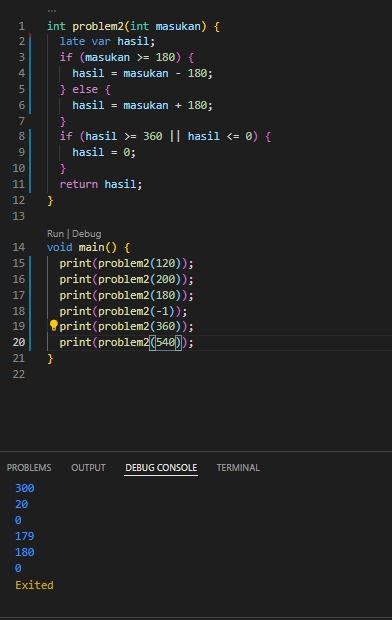

## Big taks 1

### 1. Problem Satu
Membuat sebuah fungsi yang dimana menerima sebuah angka yang meretrunkan true apabila angka genap dan retrunkan false apabila angka ganjil

Berikut kode tugas problem pertama.

[problem_1.dart](./codingan/problem_1.dart)

Jadi untuk menentukan angka itu ganjil genap saya menggunakan kondisi if dan if else yang dimana setiap masukan angka % 2 sama dengan 0 maka otomatis nilai tersebut genap dan apabila nilai % 3 atau %1 = 0 maka ganjil

output badges:

### 2. Problem Dua
Pada problem kedua ini menerima sebuah angka yang kondisinya jika masukan lebih dari 180 maka masukan dikurangi dengan 180, jika kurang masukan kurang dari 180 maka masukan + 180,dan apabila return melebihi 360 atau kurang dari sama dengan 0 maka return 0

Berikut kode problem 2.

[problem_2.dart](./codingan/problem_2.dart)

Untuk problem dua ini saya menggunakan if else untuk menetukan kondisi seperti yang diminta
output:

### 3. Problem Tiga
Pada problem kedua ini membuat jam pasir sesuai inputan

Berikut kode problem 3.

[problem_3.dart](./codingan/problem_3.dart)

Untuk problem 3 ini menurut saya lumayan sulit, yang dimana menggunakan perulangan didalam perulangan sampai membentuk sebuah jam pasir
output:

### 4. Problem Empat

Pada problem keempat ini menerima angka dan menampilkan sebuah diagonal

Berikut kode problem 4.

[problem_4.dart](./codingan/problem_4.dart)

Sama hal nya dengan problem 3, pada problem 4 ini menggunakan perulangan didalam perulangan
output:

